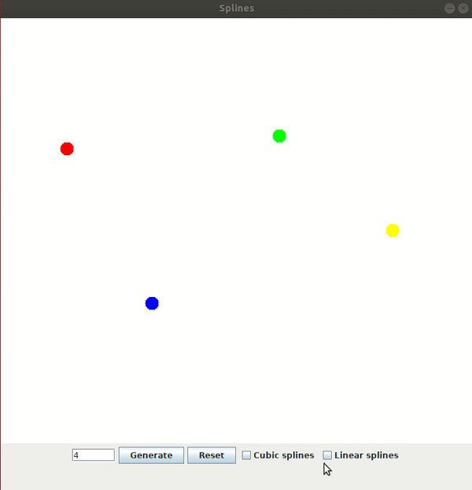
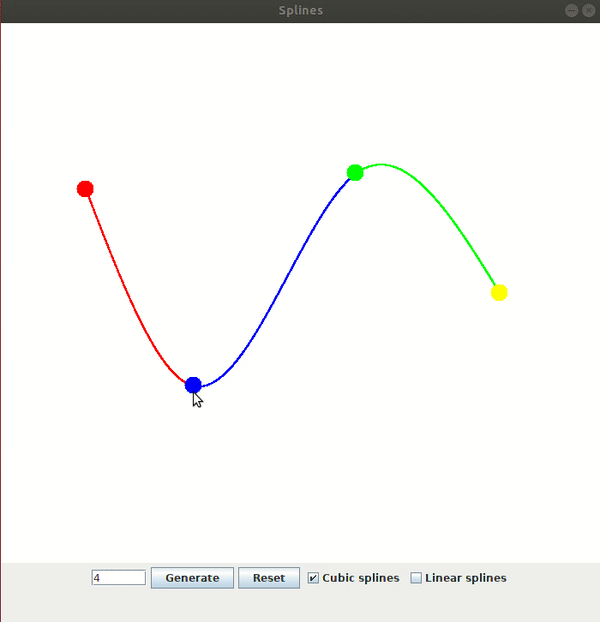
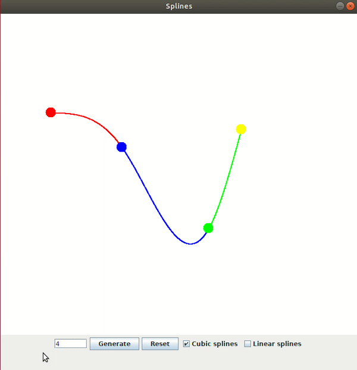

# Spline Interpolation

In the mathematical field of numerical analysis, spline interpolation is a form of interpolation where the interpolant is a special type of piecewise polynomial called a spline.  
Originally, spline was a term for elastic rulers that were bent to pass through a number of predefined points ("knots"). These were used to make technical drawings for shipbuilding and construction by hand.  
The approach to mathematically model the shape of such elastic rulers fixed by n + 1 knots {(x<sub>i</sub>,y<sub>i</sub>):i=0,1, ... ,n} is to interpolate between all the pairs of knots (x<sub>i - 1</sub>,y<sub>i - 1</sub>) and (x<sub>i</sub>,y<sub>i</sub>) with polynomials y = q<sub>i</sub>(x), i = 1, 2, ..., n.

## Program features

* The amount of knots can be indicated by the user using a text field and a button to generate them randomly. The user can also remove the knots with a button.


* There are two checkbox to specify which kinds of splines will be visualized.



* The user can move freely any knots dragging it with the mouse.



* Another way to move a knot is selecting it pressing 'n' key (the selected knot is indicated by the black color) and using 'w', 'a', 's' and 'd' keys. The coordinates of the selected knot will be displayed.



## Execution

For execution, try the command below:
```bash
  java -jar Splines.jar
```


## Author

Daute Rodríguez Rodríguez
